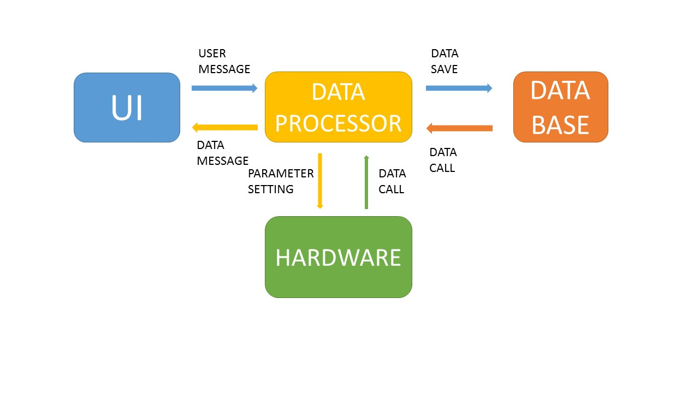

谱仪系统  
==========================
*2016秋*
--------------------------
***
## 软件  
*——"罗洋"*
### 需求及功能分析
* 基本功能  
    - 数据归档保存阅览 *打开、浏览、查找、保存（格式设置）*
    - 能谱数据读取 *采集控制（计数方式、通道设置、ADC参数设置）、开始/停止读数*
    - 能谱数据处理 *道址细分、数据存储、寻峰、积分、半高宽*
    - 能谱数据显示 *1024(能谱精度)、计数量程（自动、手动、线性、对数）*
    - 用户动作 *峰识别、放大/缩小、感兴趣区、光标动作*
* 高级功能
    - 数据高级处理 *核素识别、活度计算、本底扣除*
    - 数据显示 *画面防抖防闪、能谱平滑处理、静态/动态显示*
    - 用户设置 *能谱颜色*
    - 界面优化
    - 错误信息
### 软件规划
  
* 界面分区（ui）
    - 工具栏 *文档操作、用户设置、快捷按钮、用户帮助*
    - 控制面板 *参数设置、测量动作、采集控制*
    - 数据显示 *峰位、计数、道宽、工作状态信息*
    - 绘图区 *总体图、感兴趣图*
* 数据处理(dataprocessor)
    - 
* 数据库（database）

* 下位机(hardware)
***  
## 硬件  
*——"叶一锰"*  
***  
